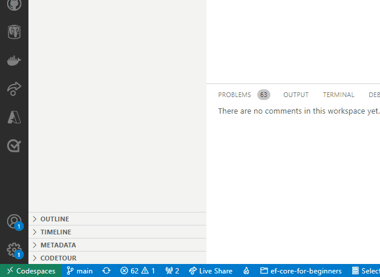
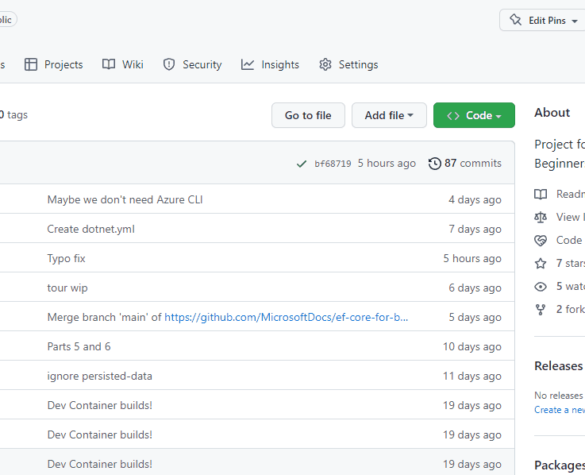

---
languages:
- csharp
products:
- dotnet-core
- ef-core
page_type: sample
name: "Code and notes for Entity Framework Core for Beginners video series"
urlFragment: "ef-core-for-beginners"
description: "All the notes and code samples to follow along with the Entity Framework Core for Beginners video series."
---

# Entity Framework Core for Beginners video series

Hi, friend! 👋 You've found the code and other materials to accompany the [Entity Framework Core for Beginners video series](https://aka.ms/ef-core-videos). We hope you'll find it enjoyable and informative. 💜

## Repository structure

The starter project for each video is located in the corresponding folder under the **parts** folder. For example, the starter project for *Getting Started with Entity Framework Core* (Part 1 of 5) is located in [parts/1-getting-started](parts/1-getting-started/).

The script, code snippets, and connection strings used for each video are located in the **notes** folder, organized by parts. For example, the notes for Part 1 are located in [notes/1-getting-started](notes/1-getting-started/).

## Requirements

If you want to code along with the videos, we strongly recommend you first watch the supplemental video, [*How to code along with these videos*](https://youtu.be/Qh42pe1Ae5U).

The courseware was designed to be followed in one of three scenarios:

- [Windows with Visual Studio](#windows-with-visual-studio)
- [Windows/macOS/Linux with .NET CLI and Visual Studio Code](#windowsmacoslinux-with-net-cli-and-visual-studio-code)
- [Windows/macOS/Linux with Docker/containers and Visual Studio Code](#windowsmacoslinux-with-dockercontainers-and-visual-studio-code) -- **Recommended scenario, in-browser option available**

### Windows with Visual Studio

This is the scenario featured in the video. This scenario requires:

- [Visual Studio](https://www.visualstudio.com) (latest)
- [SQL Server Express LocalDB](https://docs.microsoft.com/sql/database-engine/configure-windows/sql-server-express-localdb?view=sql-server-ver15)
- [PostgreSQL](https://www.postgres.org)

1. Clone the repository.
1. Install the [ContosoPizza database](.devcontainer/data/ContosoPizza.dacpac) in your LocalDB instance. Use a tool like [Azure Data Studio](https://docs.microsoft.com/sql/azure-data-studio/download-azure-data-studio) or SQL Server Management Studio.
1. For each video (parts 1-5), open the desired project file in Visual Studio. Follow along in the videos. 

### Windows/macOS/Linux with .NET CLI and Visual Studio Code

This scenario uses open source tooling and supports any operating system. This scenario requires:

- [Visual Studio Code](https://code.visualstudio.com) (please install the [recommended extensions](https://code.visualstudio.com/docs/editor/extension-marketplace#_recommended-extensions)--An *extensions.json* has been provided)
- [.NET 6 SDK](https://dot.net)
- A SQL Server instance (cloud is acceptable)
- A PostgreSQL instance (cloud is acceptable)

You are responsible for determining your own connection information for all of the above.

1. Clone the repository.
1. Install the [ContosoPizza database](.devcontainer/data/ContosoPizza.dacpac) on an accessible SQL Server instance. Use a tool like [Azure Data Studio](https://docs.microsoft.com/sql/azure-data-studio/download-azure-data-studio) or SQL Server Management Studio.
1. Open the entire repository folder in Visual Studio Code.
1. Review the recommended extensions and install them.
1. When everything is done loading, find the CodeTour for the video you're watching in the **CODETOUR** pane in the **EXPLORER** in VS Code. Right-click on the CodeTour and select **Start Tour** to begin the walkthrough. The walkthrough is in English and follows the videos step-by-step (with additional information and links).

### Windows/macOS/Linux with Docker/containers and Visual Studio Code

This scenario uses open source tooling and supports any operating system. The development container includes ALL prerequisties, including SQL Server, PostgreSQL, .NET SDK, and more. The ContosoPizza SQL Server database is also pre-configured. This is the recommended scenario.

This scenario requires:

- [Visual Studio Code](https://code.visualstudio.com) with the [Remote Development - Containers](https://marketplace.visualstudio.com/items?itemName=ms-vscode-remote.remote-containers) extension 
- A compatible container environment. See [Visual Studio Code documentation](http://aka.ms/vscode-remote/containers/tutorial) for more.

1. Clone the repository.
1. Open Visual Studio Code without opening a folder.
1. Press <kbd>Ctrl</kbd>+<kbd>Shift</kbd>+<kbd>P</kbd> to open the command palette. Search for and select **Remote Containers-Open Folder in Container...**. Select the entire repository folder.
1. When everything is done loading, find the CodeTour for the video you're watching in the **CODETOUR** pane in the **EXPLORER** in VS Code. Right-click on the CodeTour and select **Start Tour** to begin the walkthrough. The walkthrough is in English and follows the videos step-by-step (with additional information and links). See [the animation above](.tours/media/readme-launch-codetour.gif) to see an example of launching a CodeTour.

**Alternatively**, this scenario can be completed **in-browser with no local tools** using [GitHub Codespaces](https://visualstudio.microsoft.com/services/github-codespaces/).

1. Just navigate to the [repository](https://github.com/MicrosoftDocs/ef-core-for-beginners), select **Code**, and create a new Codespace using the `main` branch. 
1. When everything is done loading, locate the CodeTour pane in the explorer, find the CodeTour for the video you're watching, and launch as described above.

## Relevant links

[Video series courseware repository](https://github.com/MicrosoftDocs/ef-core-for-beginners)

### Part 1

- [Starter project](https://github.com/MicrosoftDocs/ef-core-for-beginners/tree/main/parts/1-getting-started/ContosoPizza)
- [Notes and code snippets](https://github.com/MicrosoftDocs/ef-core-for-beginners/tree/main/notes/part1)
- [Migrations Overview](https://docs.microsoft.com/ef/core/managing-schemas/migrations/)
- [Null safety in C# (Microsoft Learn)](https://docs.microsoft.com/learn/modules/csharp-null-safety/)
- [Persist and retrieve relational data with Entity Framework Core (Microsoft Learn)](https://docs.microsoft.com/learn/modules/persist-data-ef-core/)

### Part 2

- [Starter project](https://github.com/MicrosoftDocs/ef-core-for-beginners/tree/main/parts/2-existing-databases/ContosoPizza)
- [Notes and code snippets](https://github.com/MicrosoftDocs/ef-core-for-beginners/tree/main/notes/part2)
- [Reverse Engineering](https://docs.microsoft.com/ef/core/managing-schemas/scaffolding)

### Part 3

- [Starter project](https://github.com/MicrosoftDocs/ef-core-for-beginners/tree/main/parts/3-web-sites/ContosoPizza)
- [Notes and code snippets](https://github.com/MicrosoftDocs/ef-core-for-beginners/tree/main/notes/part3)
- [Safe storage of app secrets in development in ASP.NET Core](https://docs.microsoft.com/aspnet/core/security/app-secrets)
- [Tutorial: Create a Razor Pages web app with ASP.NET Core](https://docs.microsoft.com/aspnet/core/tutorials/razor-pages)
- [Connection Strings (Entity Framework Core docs)](https://aka.ms/ef-core-connection-strings)

### Part 4

- [Starter project](https://github.com/MicrosoftDocs/ef-core-for-beginners/tree/main/parts/4-database-providers/ContosoPizza)
- [Notes and code snippets](https://github.com/MicrosoftDocs/ef-core-for-beginners/tree/main/notes/part4)
- [Full list of database providers](https://docs.microsoft.com/ef/core/providers/).
- [DB Browser for SQLite](https://sqlitebrowser.org/)
- [PostgreSQL](https://www.postgresql.org/)
- [Quickstart: Create an Azure Cosmos account, database, container, and items from the Azure portal](https://docs.microsoft.com/azure/cosmos-db/sql/create-cosmosdb-resources-portal)
- [Azure Cosmos DB local emulator](https://docs.microsoft.com/azure/cosmos-db/local-emulator)
- [Free Azure Account](https://azure.microsoft.com/free/dotnet/)

### Part 5

- [Starter project](https://github.com/MicrosoftDocs/ef-core-for-beginners/tree/main/parts/5-performance-tips/ContosoPizza)
- [Notes and code snippets](https://github.com/MicrosoftDocs/ef-core-for-beginners/tree/main/notes/part5)
- [No-tracking queries](https://docs.microsoft.com/ef/core/querying/tracking#no-tracking-queries)
- [Loading related data](https://docs.microsoft.com/ef/core/querying/related-data)
- [Split queries](https://docs.microsoft.com/ef/core/querying/single-split-queries)
- [`DbContext` pooling](https://docs.microsoft.com/ef/core/performance/advanced-performance-topics#dbcontext-pooling)
- [Raw SQL queries](https://docs.microsoft.com/ef/core/querying/raw-sql)

### Supplemental Video

- [CodeTour extension](https://marketplace.visualstudio.com/items?itemName=vsls-contrib.codetour)
- [SQL Server Express Local DB](https://docs.microsoft.com/sql/database-engine/configure-windows/sql-server-express-localdb?view=sql-server-ver15)
- [Download and install Azure Data Studio](https://docs.microsoft.com/sql/azure-data-studio/download-azure-data-studio)
- [Developing inside a container (Visual Studio Code)](https://code.visualstudio.com/docs/remote/containers)
- [GitHub Codespaces (Visual Studio Code)](https://code.visualstudio.com/docs/remote/codespaces)

# Contributing

This project welcomes contributions and suggestions.  Most contributions require you to agree to a
Contributor License Agreement (CLA) declaring that you have the right to, and actually do, grant us
the rights to use your contribution. For details, visit https://cla.opensource.microsoft.com.

When you submit a pull request, a CLA bot will automatically determine whether you need to provide
a CLA and decorate the PR appropriately (e.g., status check, comment). Simply follow the instructions
provided by the bot. You will only need to do this once across all repos using our CLA.

This project has adopted the [Microsoft Open Source Code of Conduct](https://opensource.microsoft.com/codeofconduct/).
For more information see the [Code of Conduct FAQ](https://opensource.microsoft.com/codeofconduct/faq/) or
contact [opencode@microsoft.com](mailto:opencode@microsoft.com) with any additional questions or comments.

# Legal Notices

Microsoft and any contributors grant you a license to the Microsoft documentation and other content
in this repository under the [Creative Commons Attribution 4.0 International Public License](https://creativecommons.org/licenses/by/4.0/legalcode),
see the [LICENSE](LICENSE) file, and grant you a license to any code in the repository under the [MIT License](https://opensource.org/licenses/MIT), see the
[LICENSE-CODE](LICENSE-CODE) file.

Microsoft, Windows, Microsoft Azure and/or other Microsoft products and services referenced in the documentation
may be either trademarks or registered trademarks of Microsoft in the United States and/or other countries.
The licenses for this project do not grant you rights to use any Microsoft names, logos, or trademarks.
Microsoft's general trademark guidelines can be found at http://go.microsoft.com/fwlink/?LinkID=254653.

Privacy information can be found at https://privacy.microsoft.com/en-us/

Microsoft and any contributors reserve all other rights, whether under their respective copyrights, patents,
or trademarks, whether by implication, estoppel or otherwise.
